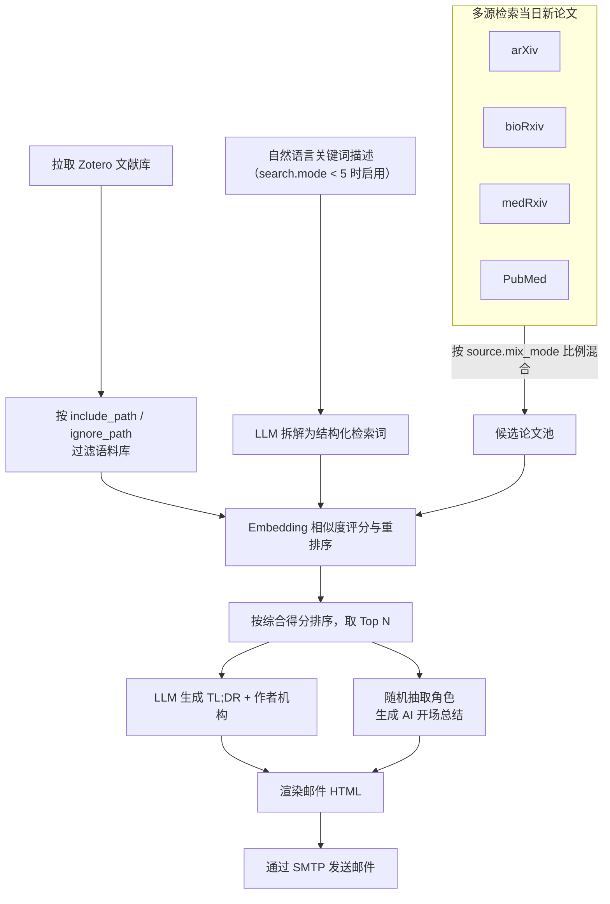

<p align="center">
  <a href="" rel="noopener">
 </a>
</p>

<h3 align="center">每日吃论文（Eat PubMed Paper Daily）</h3>

<div align="center">

  []()
  
  [](https://github.com/HanluXU/eat-pubmed-paper-daily/issues)
  [](/LICENSE)

</div>

<p align="center">
  <b>中文</b> | <a href="README_EN.md">English</a>
</p>

---

<p align="center"> 根据你的 Zotero 文献库和/或研究关键词，每天为你推荐感兴趣的 arXiv / bioRxiv / medRxiv / PubMed 新论文。
    <br>
</p>

## 🧐 关于本项目 <a name = "about"></a>

> 只需 Fork（并点个 star😊）本仓库，即可持续追踪你感兴趣的最新科研进展！

本项目会根据你的 Zotero 文献库内容，和/或你用自然语言描述的研究兴趣，从 arXiv / bioRxiv / medRxiv / PubMed 中筛选出可能吸引你的新论文，并将结果发送到你的邮箱📮。整个流程完全基于 Github Action Workflow 运行，**零成本**、**无需维护服务器**，只需在 Github Action 中配置**少量环境变量**，即可实现周期性**自动**推送。

> 本项目改造自 [TideDra/zotero-arxiv-daily](https://github.com/TideDra/zotero-arxiv-daily)，在原项目基础上新增了 PubMed 检索以及一系列个性化功能（关键词/Zotero 混合评分、来源比例调节、收藏期刊加权、AI 开场总结等）。详见下方[致谢](#-致谢)部分。

## ✨ 功能特性
- 完全免费！所有计算都在 Github Action Runner 上本地完成，处于其免费额度内（公开仓库）。
- AI 生成 TL;DR 摘要，帮你快速定位目标论文。
- 自动解析并展示论文的作者机构信息。
- 邮件中附带论文 PDF 链接及代码实现链接（如有）。
- 论文列表按与你近期研究兴趣的相关度排序。
- 只需 Fork 本仓库并在 Github Action 页面设置环境变量，即可快速部署。
- 支持通过 LLM API 生成论文 TL;DR。
- 支持用一组 glob 匹配模式忽略不需要的 Zotero 文献。
- **灵活评分模式**：5 档调节旋钮，用于混合"关键词评分"与"Zotero 文献库评分"的权重，也支持没有 Zotero 文献库的用户（纯关键词模式）。
- **自然语言关键词**：用大白话描述你的研究兴趣，LLM 会自动将其拆解为结构化的检索词。
- **PubMed 数据源**：支持从 PubMed 检索论文（仅摘要），适合临床医学研究方向的用户。
- **来源比例调节**：5 档调节旋钮，控制 PubMed 与 arXiv/bioRxiv/medRxiv 论文的比例。
- **自定义检索窗口**：可检索过去 N 天内发布的论文，而不仅限于昨天。
- **自定义发送周期**：支持配置按周或多日发送邮件（详见 [docs/cron-guide.md](docs/cron-guide.md)）。
- **AI 开场总结**：每封邮件开头会附上本批论文的中文总结，并随机扮演一个二次元/影视/文学角色（如灶门炭治郎、赫敏、甄嬛、邓布利多校长等）说一段鼓励语。角色池可在 [config/characters.yaml](config/characters.yaml) 中自由增删、修改，详见[自定义开场总结角色](#自定义开场总结角色)。
- 支持从以下多个来源检索论文：
  - arxiv
  - biorxiv
  - medrxiv
  - **pubmed**（新增）

## 🚀 使用方法
### 快速开始
1. Fork（并点个 star😘）本仓库。

2. 进入你 Fork 后仓库的 **Settings → Secrets and variables → Actions → Secrets**，设置以下仓库 Secrets。出于安全考虑，设置后的值对所有人（包括你自己）都不可见。

| 名称 |说明 | 示例 |
| :---  | :---  | :--- |
| ZOTERO_ID  | 你的 Zotero 账号 User ID。**User ID 不是用户名，而是一串数字。** 可以从[这里](https://www.zotero.org/settings/security)获取（页面上显示为 "Your userID for use in API calls"）。 | 12345678  |
| ZOTERO_KEY | 一个具有读取权限的 Zotero API Key。从[这里](https://www.zotero.org/settings/security)获取。  | AB5tZ877P2j7Sm2Mragq041H   |
| SENDER | 用于发送邮件的 SMTP 服务器邮箱账号。 | abc@qq.com |
| SENDER_PASSWORD | 发送邮箱的密码。注意这通常不是登录邮箱客户端的密码，而是该邮箱 SMTP 服务的授权码，请向你的邮箱服务商获取。   | abcdefghijklmn |
| RECEIVER | 接收论文推送列表的邮箱地址。 | abc@outlook.com |
| OPENAI_API_KEY | 调用 LLM API 所需的 API Key。你可以在 [SiliconFlow](https://cloud.siliconflow.cn/i/b3XhBRAm) 免费获取调用优秀开源大模型的 API。 | sk-xxx |
| OPENAI_API_BASE | 调用 LLM API 的地址。 | https://api.siliconflow.cn/v1 |

然后进入 **Settings → Secrets and variables → Actions → Variables**，新增一个名为 `CUSTOM_CONFIG` 的仓库变量，用于个性化配置。
将以下内容粘贴到 `CUSTOM_CONFIG` 变量的值中——这里已经包含了全部可配置项，按需修改即可；带 `${oc.env:XXX}` 的字段会在运行时从你上面设置的 Secrets 中读取，**不要**把真实的 key、密码等敏感信息以明文形式填在这里：
```yaml
zotero:
  user_id: ${oc.env:ZOTERO_ID}
  api_key: ${oc.env:ZOTERO_KEY}
  include_path: null # 只想推送特定 Zotero 分类下的论文时使用。示例: ["2026/survey/**", "2026/reading-group/**"]
  ignore_path: null # 想排除特定 Zotero 分类时使用。示例: ["archive/**"]

search:
  mode: 5 # 评分模式旋钮。1=纯关键词, 2=偏关键词/少Zotero, 3=各占一半, 4=少关键词/偏Zotero, 5=纯Zotero
  keywords: null # 当 mode < 5 时必填，用自然语言描述你的研究兴趣。示例: "眼科水凝胶材料结合中医药"

source:
  mix_mode: 5 # 来源比例旋钮。1=纯PubMed, 2=偏PubMed/少arXiv, 3=各占一半, 4=少PubMed/偏arXiv, 5=纯arXiv
  arxiv:
    category: ["cs.AI","cs.CV","cs.LG","cs.CL"] # 换成你感兴趣的 arXiv 分类，参考 https://arxiv.org/category_taxonomy
    include_cross_list: false # 设为 true 可包含这些分类下的 arXiv 交叉列表论文
  biorxiv:
    category: null # 若 executor.source 中包含 biorxiv 则必填，否则启动会报错。示例: ["biochemistry","animal behavior and cognition"]
  medrxiv:
    category: null # 若 executor.source 中包含 medrxiv 则必填，否则启动会报错。示例: ["psychiatry and clinical psychology", "neurology"]
  pubmed:
    max_results: 200 # 从 PubMed 抓取的最大论文数

email:
  sender: ${oc.env:SENDER}
  receiver: ${oc.env:RECEIVER}
  smtp_server: smtp.qq.com # 换成你自己邮箱服务商的 SMTP 服务器
  smtp_port: 465
  sender_password: ${oc.env:SENDER_PASSWORD}

llm:
  api:
    key: ${oc.env:OPENAI_API_KEY}
    base_url: ${oc.env:OPENAI_API_BASE}
  generation_kwargs:
    max_tokens: 16384
    model: gpt-4o-mini # 换成你所用 LLM 服务支持的模型名
  language: English # TL;DR 摘要使用的语言。示例: Chinese

reranker:
  local:
    model: jinaai/jina-embeddings-v5-text-nano
    encode_kwargs:
      task: retrieval
      prompt_name: document
  api:
    key: null # 当 executor.reranker=api 时必填
    base_url: null
    model: null
    batch_size: null

executor:
  debug: ${oc.env:DEBUG,null}
  send_empty: false # 没有新论文时是否仍发送一封空邮件
  skip_full_text: false # 跳过下载论文全文 PDF/HTML，节省内存和时间
  max_paper_num: 100 # 邮件中展示的论文数量上限
  source: ['arxiv'] # 论文来源。示例: ['arxiv'] 或 ['arxiv','biorxiv','medrxiv']。选了 biorxiv/medrxiv 就必须同时在上面 source.biorxiv/medrxiv.category 填对应分类，否则启动会报错
  reranker: local # 'local' 或 'api'
  retrieval_days: 1 # 回溯检索的天数。示例: 7 表示检索最近一周
  send_interval_days: 1 # 仅供 cron 配置参考，详见 docs/cron-guide.md
  favorite_journals: null # 需要加权的收藏期刊列表，命中的论文得分 ×1.5。示例: ["Nature Medicine", "The Lancet", "JAMA"]
```
> [!NOTE]
> `${oc.env:XXX,yyy}` 表示读取环境变量 `XXX` 的值；如果该环境变量未设置，则使用默认值 `yyy`。

配置完成！现在你可以在 Fork 仓库的 **Actions** 标签页手动触发工作流进行测试（选择 "Test" 工作流 → "Run workflow"）。

> [!NOTE]
> Test 工作流是主工作流（Send-emails-daily）的调试版本，它总是固定抓取 5 篇 arxiv 论文，不受日期限制。而主工作流会每天自动触发，检索昨天发布的新论文。周末和节假日通常没有新的 arxiv 论文，此时主工作流的日志中可能会看到 "No new papers found"。

工作流运行结束后，请检查日志以及接收邮箱。

默认情况下，主工作流每天 UTC 时间 22:00 运行。你可以通过编辑 `.github/workflows/main.yml` 中的工作流配置来修改这个时间。关于配置自定义发送周期的详细说明，请参考 [docs/cron-guide.md](docs/cron-guide.md)。

### 本地运行
本项目基于 [uv](https://github.com/astral-sh/uv) 管理依赖，只要安装了 uv，即可在本地设备上轻松运行：
```bash
# 先设置好所有需要的环境变量
# export ZOTERO_ID=xxxx
# ...
cd eat-pubmed-paper-daily
uv run src/zotero_arxiv_daily/main.py
```

### 自定义开场总结角色 <a name = "自定义开场总结角色"></a>
每次发送邮件时，程序会从 [config/characters.yaml](config/characters.yaml) 中随机抽取一个角色，用它的口吻生成开场总结和鼓励语。你可以：
- 直接编辑 Fork 仓库中的 `config/characters.yaml`：增加、删除或修改角色。每个角色包含 `name`（角色名）和 `prompt`（system prompt）两个字段。
- 或者不修改仓库文件，改为在 `CUSTOM_CONFIG` 变量中新增 `executor.character_pool` 字段来完全覆盖默认角色池。
- 将 `character_pool` 设为空列表 `[]` 可以完全关闭 AI 开场总结功能。

## 📖 工作原理
本项目首先通过相应 API 获取你 Zotero 文献库中的所有论文（如果已配置），以及从已配置来源（arXiv / bioRxiv / medRxiv / PubMed）发布的所有新论文。然后通过 embedding 模型计算每篇论文摘要的向量表示，和/或将其与你的自然语言关键词进行匹配。一篇论文的最终得分融合了关键词相关度，以及它与你 Zotero 文献库论文的加权平均相似度（越晚加入文献库的论文权重越高）。每篇论文的 TL;DR 由 LLM 根据从论文中提取的文本生成。



## 📌 局限性
- 推荐算法非常简单，可能无法精准反映你的兴趣。欢迎提出更好的改进思路！
- 过高的 `MAX_PAPER_NUM` 可能导致执行时间超出 Github Action Runner 的限制（公开仓库每次执行最长 6 小时，每月总计 2000 分钟）。通常公开仓库的免费额度对个人使用来说完全够用。如果你有特殊需求，可以将工作流部署到自己的服务器上，或使用自托管的 Github Action Runner，或为超出的执行时间付费。

## 👯‍♂️ 贡献
欢迎提交 Issue 和 PR！

## 📃 许可证
基于 AGPLv3 许可证发布，详见 `LICENSE` 文件。

## ❤️ 致谢
- [TideDra/zotero-arxiv-daily](https://github.com/TideDra/zotero-arxiv-daily) —— 本项目 Fork 和扩展的原始项目
- [pyzotero](https://github.com/urschrei/pyzotero)
- [arxiv](https://github.com/lukasschwab/arxiv.py)
- [sentence_transformers](https://github.com/UKPLab/sentence-transformers)

## 🌟 Star 历史

[](https://star-history.com/#HanluXU/eat-pubmed-paper-daily&Date)
