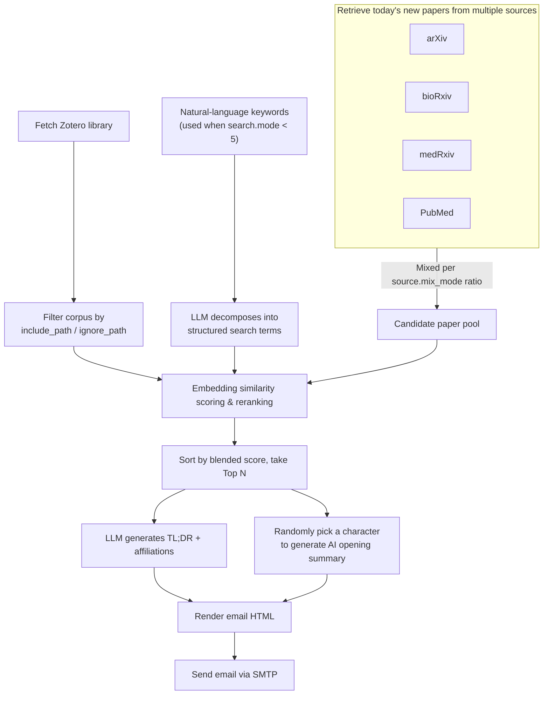

<p align="center">
  <a href="" rel="noopener">
 </a>
</p>

<h3 align="center">Eat PubMed Paper Daily</h3>

<div align="center">

  []()
  
  [](https://github.com/HanluXU/eat-pubmed-paper-daily/issues)
  [](/LICENSE)

</div>

<p align="center">
  <a href="README.md">中文</a> | <b>English</b>
</p>

---

<p align="center"> Recommend new arXiv / bioRxiv / medRxiv / PubMed papers of your interest daily according to your Zotero library and/or research keywords.
    <br>
</p>

## 🧐 About <a name = "about"></a>

> Track new scientific researches of your interest by just forking (and staring) this repo!😊

This project finds new papers (arXiv / bioRxiv / medRxiv / PubMed) that may attract you based on the context of your Zotero library and/or a natural-language description of your research interests, and then sends the result to your mailbox📮. It runs entirely as a Github Action Workflow with **zero cost**, **no server to maintain**, and **few configuration** of Github Action environment variables for periodic **automatic** delivery.

> This project is a customized fork of [TideDra/zotero-arxiv-daily](https://github.com/TideDra/zotero-arxiv-daily), extended with PubMed retrieval and several personalization features (keyword/Zotero scoring blend, source mix control, favorite journals, AI opening summary, etc.). See [Acknowledgement](#-acknowledgement) below.

## ✨ Features
- Totally free! All the calculation can be done in the Github Action runner locally within its quota (for public repo).
- AI-generated TL;DR for you to quickly pick up target papers.
- Affiliations of the paper are resolved and presented.
- Links of PDF and code implementation (if any) presented in the e-mail.
- List of papers sorted by relevance with your recent research interest.
- Fast deployment via fork this repo and set environment variables in the Github Action Page.
- Support LLM API for generating TL;DR of papers.
- Ignore unwanted Zotero papers using a list of glob patterns.
- **Flexible scoring mode**: 5-level dial to blend keyword-based scoring and Zotero-library-based scoring. Supports users without a Zotero library (keyword-only mode).
- **Natural language keywords**: Describe your research interest in plain language; LLM decomposes it into structured search terms automatically.
- **PubMed source**: Retrieve papers from PubMed (abstract-only), suitable for clinical research communities.
- **Source mix dial**: 5-level dial to control the ratio of PubMed vs. arXiv/bioRxiv/medRxiv papers.
- **Custom retrieval window**: Retrieve papers from the past N days, not just yesterday.
- **Custom sending interval**: Configure weekly or multi-day email delivery (see [docs/cron-guide.md](docs/cron-guide.md)).
- **AI opening summary**: Each email starts with a Chinese summary of the batch, followed by an encouraging message randomly voiced by an ACG/movie/literature character (e.g. Tanjiro, Hermione, Dumbledore). The character pool can be freely edited in [config/characters.yaml](config/characters.yaml), see [Customizing the opening-summary characters](#customizing-the-opening-summary-characters).
- Support multiple sources of papers to retrieve:
  - arxiv
  - biorxiv
  - medrxiv
  - **pubmed** (new)

## 🚀 Usage
### Quick Start
1. Fork (and star😘) this repo.

2. Go to your fork's **Settings → Secrets and variables → Actions → Secrets** and set the following repository secrets. They are invisible to anyone including you once they are set, for security.

| Key |Description | Example |
| :---  | :---  | :--- |
| ZOTERO_ID  | User ID of your Zotero account. **User ID is not your username, but a sequence of numbers.** Get your ID from [here](https://www.zotero.org/settings/security) (shown as "Your userID for use in API calls"). | 12345678  |
| ZOTERO_KEY | An Zotero API key with read access. Get a key from [here](https://www.zotero.org/settings/security).  | AB5tZ877P2j7Sm2Mragq041H   |
| SENDER | The email account of the SMTP server that sends you email. | abc@qq.com |
| SENDER_PASSWORD | The password of the sender account. Note that it's not necessarily the password for logging in the e-mail client, but the authentication code for SMTP service. Ask your email provider for this.   | abcdefghijklmn |
| RECEIVER | The e-mail address that receives the paper list. | abc@outlook.com |
| OPENAI_API_KEY | API Key when using the API to access LLMs. You can get FREE API for using advanced open source LLMs in [SiliconFlow](https://cloud.siliconflow.cn/i/b3XhBRAm). | sk-xxx |
| OPENAI_API_BASE | API URL when using the API to access LLMs. | https://api.siliconflow.cn/v1 |

Then go to **Settings → Secrets and variables → Actions → Variables** and add a repository variable named `CUSTOM_CONFIG` for your custom configuration.
Paste the following content into the value of `CUSTOM_CONFIG` variable — this already covers every configurable field, edit it as needed. Fields with `${oc.env:XXX}` are resolved at runtime from the Secrets you set above; **do not** paste real keys/passwords here in plain text:
```yaml
zotero:
  user_id: ${oc.env:ZOTERO_ID}
  api_key: ${oc.env:ZOTERO_KEY}
  include_path: null # Use this to only push papers from specific Zotero collections. Example: ["2026/survey/**", "2026/reading-group/**"]
  ignore_path: null # Use this to exclude specific Zotero collections. Example: ["archive/**"]

search:
  mode: 5 # Scoring weight dial. 1=keyword only, 2=more keyword/less Zotero, 3=equal, 4=less keyword/more Zotero, 5=Zotero only
  keywords: null # Required when mode < 5. Natural language description of your research interests. Example: "hydrogel materials in ophthalmology combined with traditional Chinese medicine"

source:
  mix_mode: 5 # Source mix dial. 1=PubMed only, 2=more PubMed/less arXiv, 3=equal, 4=less PubMed/more arXiv, 5=arXiv only
  arxiv:
    category: ["cs.AI","cs.CV","cs.LG","cs.CL"] # Replace with the arXiv categories you're interested in, see https://arxiv.org/category_taxonomy
    include_cross_list: false # Set to true to include arXiv cross-list papers in these categories
  biorxiv:
    category: null # Example: ["biochemistry","animal behavior and cognition"]
  medrxiv:
    category: null # Example: ["psychiatry and clinical psychology", "neurology"]
  pubmed:
    max_results: 200 # Max papers to fetch from PubMed

email:
  sender: ${oc.env:SENDER}
  receiver: ${oc.env:RECEIVER}
  smtp_server: smtp.qq.com # Replace with your own email provider's SMTP server
  smtp_port: 465
  sender_password: ${oc.env:SENDER_PASSWORD}

llm:
  api:
    key: ${oc.env:OPENAI_API_KEY}
    base_url: ${oc.env:OPENAI_API_BASE}
  generation_kwargs:
    max_tokens: 16384
    model: gpt-4o-mini # Replace with a model supported by your LLM provider
  language: English # Preferred language for TL;DR summaries. Example: Chinese

reranker:
  local:
    model: jinaai/jina-embeddings-v5-text-nano
    encode_kwargs:
      task: retrieval
      prompt_name: document
  api:
    key: null # Required when executor.reranker=api
    base_url: null
    model: null
    batch_size: null

executor:
  debug: ${oc.env:DEBUG,null}
  send_empty: false # Whether to still send an empty email when no new papers are found
  skip_full_text: false # Skip downloading full text PDFs/HTML for papers. Saves memory and time
  max_paper_num: 100 # Maximum number of papers shown in the email
  source: ['arxiv'] # Paper sources. Example: ['arxiv'] or ['arxiv','biorxiv','medrxiv']
  reranker: local # 'local' or 'api'
  retrieval_days: 1 # Days back to retrieve papers. Example: 7 for last week
  send_interval_days: 1 # For cron reference only. See docs/cron-guide.md
  favorite_journals: null # A list of journal names to boost in ranking. Papers from these journals get 1.5x score. Example: ["Nature Medicine", "The Lancet", "JAMA"]
```
> [!NOTE]
> `${oc.env:XXX,yyy}` means the value of the environment variable `XXX`. If the variable is not set, the default value `yyy` will be used.

That's all! Now you can test the workflow by manually triggering it from the **Actions** tab of your fork (select the "Test" workflow → "Run workflow").

> [!NOTE]
> The Test-Workflow Action is the debug version of the main workflow (Send-emails-daily), which always retrieve 5 arxiv papers regardless of the date. While the main workflow will be automatically triggered everyday and retrieve new papers released yesterday. There is no new arxiv paper at weekends and holiday, in which case you may see "No new papers found" in the log of main workflow.

Then check the log and the receiver email after it finishes.

By default, the main workflow runs on 22:00 UTC everyday. You can change this time by editing the workflow config `.github/workflows/main.yml`. See [docs/cron-guide.md](docs/cron-guide.md) for detailed instructions on configuring custom sending intervals.

### Local Running
Supported by [uv](https://github.com/astral-sh/uv), this workflow can easily run on your local device if uv is installed:
```bash
# set all the environment variables
# export ZOTERO_ID=xxxx
# ...
cd eat-pubmed-paper-daily
uv run src/zotero_arxiv_daily/main.py
```

### Customizing the opening-summary characters <a name = "customizing-the-opening-summary-characters"></a>
Every time an email is sent, the program randomly picks one character from [config/characters.yaml](config/characters.yaml) and uses its voice to generate the opening summary and encouragement message. You can:
- Edit `config/characters.yaml` directly in your fork: add, remove, or modify characters. Each character has a `name` and a `prompt` (system prompt) field.
- Or, without touching repo files, add an `executor.character_pool` field to your `CUSTOM_CONFIG` variable to fully override the default character pool.
- Set `character_pool` to an empty list `[]` to disable the AI opening summary feature entirely.

## 📖 How it works
This project firstly retrieves all the papers in your Zotero library (if configured) and all the new papers released from the configured sources (arXiv / bioRxiv / medRxiv / PubMed), via corresponding API. Then it calculates the embedding of each paper's abstract via an embedding model, and/or matches it against your natural-language keywords. The score of a paper blends keyword relevance and its weighted average similarity to your Zotero papers (newer paper added to the library has higher weight). The TLDR of each paper is generated by LLM, given the text extracted from the paper.



## 📌 Limitations
- The recommendation algorithm is very simple, it may not accurately reflect your interest. Welcome better ideas for improving the algorithm!
- High `MAX_PAPER_NUM` can lead the execution time exceed the limitation of Github Action runner (6h per execution for public repo, and 2000 mins per month for private repo). Commonly, the quota given to public repo is definitely enough for individual use. If you have special requirements, you can deploy the workflow in your own server, or use a self-hosted Github Action runner, or pay for the exceeded execution time.

## 👯‍♂️ Contribution
Any issue and PR are welcomed!

## 📃 License
Distributed under the AGPLv3 License. See `LICENSE` for detail.

## ❤️ Acknowledgement
- [TideDra/zotero-arxiv-daily](https://github.com/TideDra/zotero-arxiv-daily) — the original project this repo is forked and extended from
- [pyzotero](https://github.com/urschrei/pyzotero)
- [arxiv](https://github.com/lukasschwab/arxiv.py)
- [sentence_transformers](https://github.com/UKPLab/sentence-transformers)

## 🌟 Star History

[](https://star-history.com/#HanluXU/eat-pubmed-paper-daily&Date)
